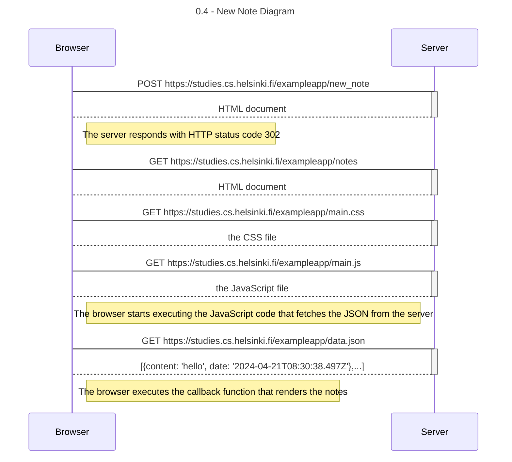

```mermaid
sequenceDiagram
    title 0.4 - New Note Diagram
    participant Browser
    participant Server

    Browser->Server: POST https://studies.cs.helsinki.fi/exampleapp/new_note
    activate Server
    Server-->Browser: HTML document
    deactivate Server
    note right of Browser:The server responds with HTTP status code 302

    Browser->Server: GET https://studies.cs.helsinki.fi/exampleapp/notes
    activate Server
    Server-->Browser: HTML document
    deactivate Server

    Browser->Server: GET https://studies.cs.helsinki.fi/exampleapp/main.css
    activate Server
    Server-->Browser: the CSS file
    deactivate Server

    Browser->Server: GET https://studies.cs.helsinki.fi/exampleapp/main.js
    activate Server
    Server-->Browser: the JavaScript file
    deactivate Server
    note right of Browser: The browser starts executing the JavaScript code that fetches the JSON from the server

    Browser->Server: GET https://studies.cs.helsinki.fi/exampleapp/data.json
    activate Server
    Server-->Browser: [{content: 'hello', date: '2024-04-21T08:30:38.497Z'},...]
    deactivate Server
    note right of Browser: The browser executes the callback function  that renders the notes
```