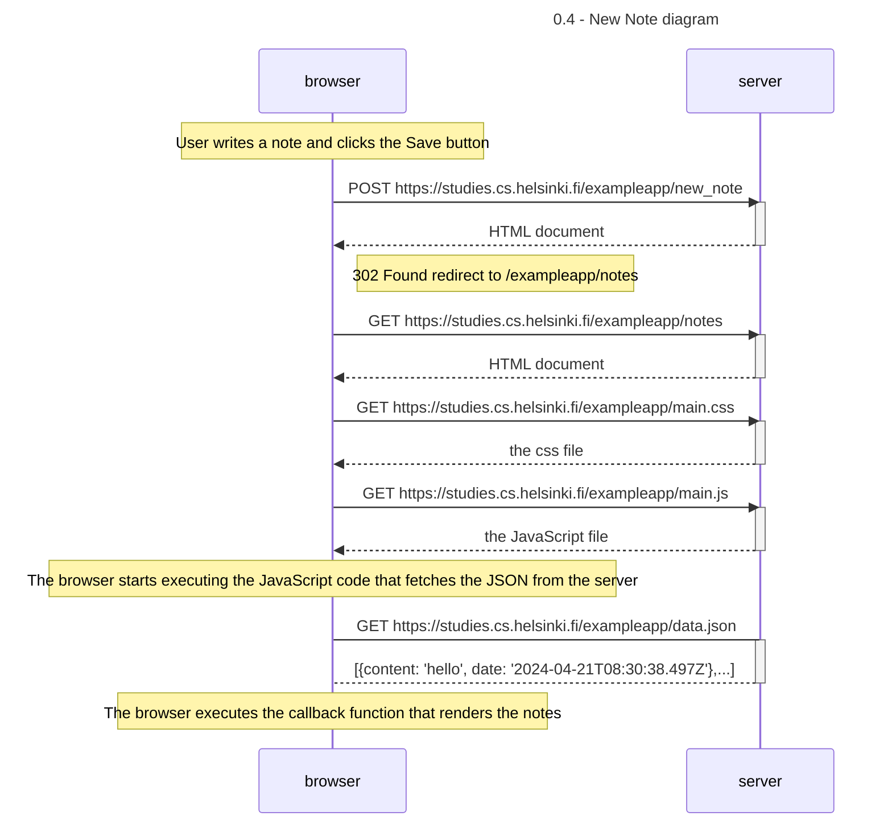

```mermaid
sequenceDiagram
    title 0.4 - New Note diagram
    participant browser
    participant server

    Note over browser: User writes a note and clicks the Save button

    browser->>server: POST https://studies.cs.helsinki.fi/exampleapp/new_note
    activate server 
    server-->>browser: HTML document
    deactivate server
    note right of browser:302 Found redirect to /exampleapp/notes 

    browser->>server: GET https://studies.cs.helsinki.fi/exampleapp/notes
    activate server
    server-->>browser: HTML document
    deactivate server

    browser->>server: GET https://studies.cs.helsinki.fi/exampleapp/main.css
    activate server
    server-->>browser: the css file
    deactivate server

    browser->>server: GET https://studies.cs.helsinki.fi/exampleapp/main.js
    activate server
    server-->>browser: the JavaScript file
    deactivate server

    Note over browser: The browser starts executing the JavaScript code that fetches the JSON from the server

    browser->server: GET https://studies.cs.helsinki.fi/exampleapp/data.json
    activate server
    server-->browser: [{content: 'hello', date: '2024-04-21T08:30:38.497Z'},...]
    deactivate server
    Note over browser: The browser executes the callback function  that renders the notes
```