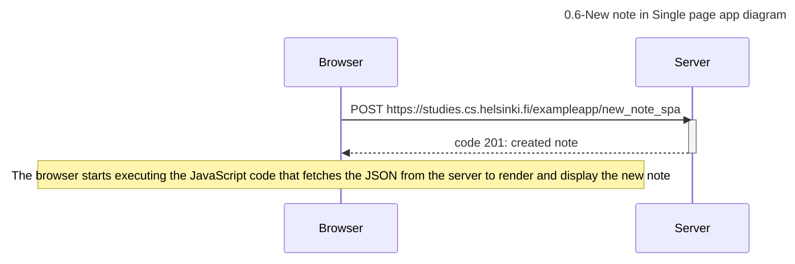

```mermaid
sequenceDiagram
    title 0.6-New note in Single page app diagram
    participant Browser
    participant Server

    Browser->>Server: POST https://studies.cs.helsinki.fi/exampleapp/new_note_spa
    activate Server
    Server-->>Browser: code 201: created note
    deactivate Server

    note over Browser: The browser starts executing the JavaScript code that fetches the JSON from the server to render and display the new note
```